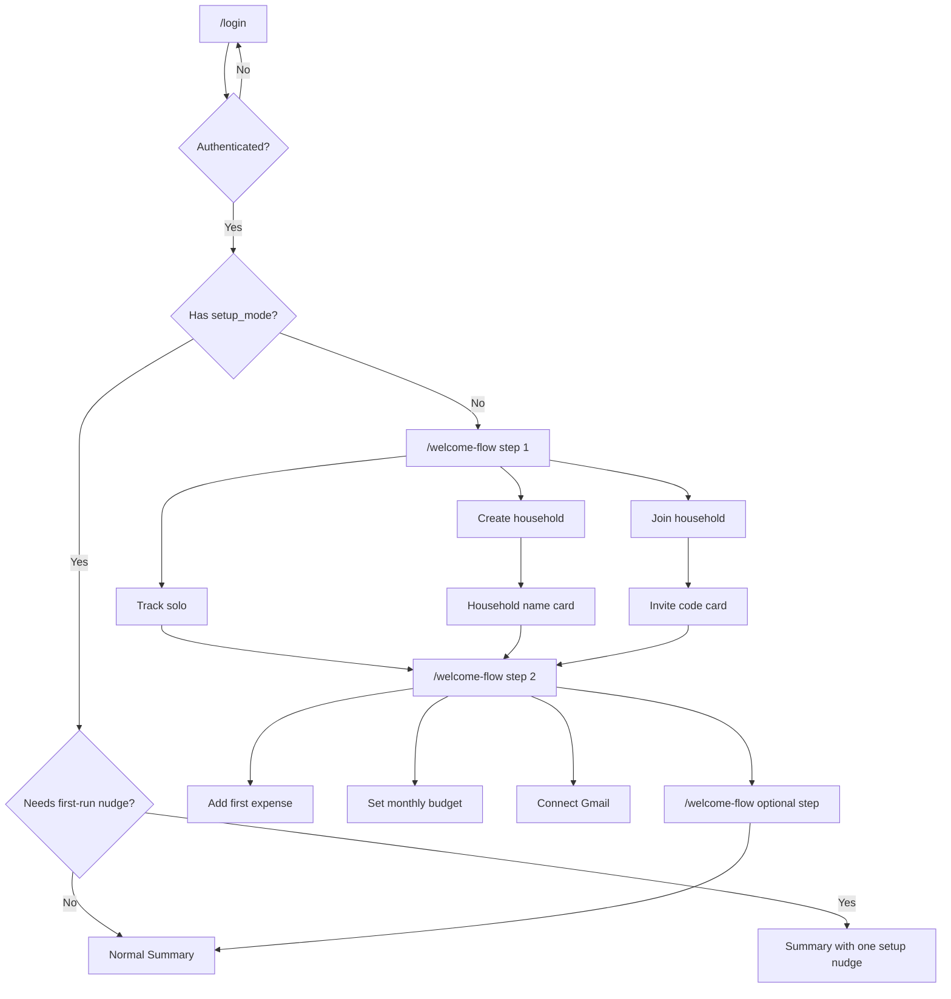

# New User Flow Redesign

## Goal

Turn the current first-run path into a **Typeform-style onboarding flow**:

1. one question at a time
2. one clear decision per screen
3. very little copy
4. immediate momentum toward first value

The product should feel like it is guiding the user, not handing them a setup dashboard.

## What changed from the previous concept

The earlier concept was directionally right, but still too heavy:

- too many checklist mechanics
- too much “setup system” language
- too many tasks visible at once
- not enough emotional simplicity for a first-time user

The revised direction is:

- **fewer choices per moment**
- **more flow, less overview**
- **lightweight cards instead of setup panels**
- **one recommended next step, not a management screen**

## Experience principles

- One question per screen
- Keep copy short enough to read in one breath
- Show progress, but do not make it feel like work
- Default to the fastest path
- Never force household setup language onto solo users
- Let optional steps feel optional
- Land the user in the app with one clear next move

## The feel we want

Think:

- Typeform
- calm mobile interview flow
- strong whitespace
- centered card
- big touch targets
- minimal decoration

Not:

- checklist app
- onboarding dashboard
- dense settings preview

## Core structure

### Recommended model

Use a single flow shell with a reusable centered card component.

That shell should provide:

- progress dots or a small `Step x of y`
- one main prompt
- 2-3 large response options
- optional `Skip for now`
- back affordance

This should be implemented as a short branching flow, not a pile of independent setup screens.

## Route / flow overview

## New flow shape

## 1. Login stays simple

### Job

Get the user into the product without starting the heavy onboarding story yet.

### Screen shape

- product name
- one sentence
- primary auth buttons
- light guest-mode explanation

### Copy bar

Keep it minimal:

- title: `Adlo`
- body: `Stay on top of spending without building a spreadsheet.`
- guest helper: `Try it first. Turn it into an account later.`

### Important behavior

If the user is already anonymous and taps Google or Apple:

- do not bounce them away
- treat it as an upgrade/link flow

## 2. Step 1 card: “How are you starting?”

### Job

Capture setup intent in the lightest possible way.

### Prompt

`How are you starting?`

### Options

- `Just me`
- `Start a shared setup`
- `Join someone`

### Supporting copy

One line max:

- `You can change this later.`

### Behavior

- `Just me` -> persist solo mode and continue
- `Start a shared setup` -> ask for household name next
- `Join someone` -> ask for invite code next

## 3. Branch card: only when needed

These should feel like tiny follow-up prompts, not separate subsystems.

### If creating a household

Prompt:

`What should this shared space be called?`

Fields:

- one text field
- primary CTA: `Continue`

### If joining

Prompt:

`Enter the invite code`

Fields:

- one text field
- primary CTA: `Continue`

## 4. Step 2 card: “What would help first?”

This replaces the heavy checklist idea.

### Job

Guide the user to the fastest first moment of value.

### Prompt

`What would help first?`

### Options

- `Add my first expense`
- `Set a monthly budget`
- `Bring in emailed receipts`

### Recommendation

For most users, visually recommend:

- `Add my first expense`

### Important product choice

This card is not asking the user to commit to everything.
It is only choosing the **first** helpful move.

That is a big difference in feel.

## 5. Optional step card

After the first choice is made, we should show at most one optional follow-up card.

### Example prompt

`Want Adlo to catch emailed receipts too?`

### Options

- `Connect Gmail`
- `Maybe later`

### Conditional variants

If the user created a household, the optional card can instead be:

`Do you want to invite someone now?`

Options:

- `Invite now`
- `Later`

### Rule

Only show one optional follow-up card in the flow.
Do not stack Gmail and invite and budget all before landing the user.

## 6. Completion card

The flow should end with a small sense of momentum, not a checklist summary.

### Prompt

`You're ready.`

### Body

Tailor it to the selected first step:

- if expense first:
  - `Add one expense and Adlo can start building from there.`
- if budget first:
  - `Set your monthly target, then Adlo can pace against it.`
- if Gmail first:
  - `Connect Gmail, then review what comes in.`

### CTA

Single primary CTA:

- `Continue`

## 7. Summary first-run treatment

Summary should no longer carry a giant getting-started card.

### Replace it with a light nudge

Instead of:

- large checklist
- multiple bullets
- setup management copy

use:

- one compact card
- one sentence
- one primary CTA

### Example

- eyebrow: `Getting started`
- title: `Add your first expense`
- body: `That is the fastest way to get Adlo working for you.`
- CTA: `Open quick add`

### Follow-up behavior

Once the user completes that action, the nudge should change to the next most useful thing:

- `Set a monthly budget`
- then maybe `Connect Gmail`

This keeps Summary feeling like the app, not an onboarding hub.

## State model

We still need a durable setup model, but the UI should not expose it heavily.

### Required fields

- `setup_mode`
  - `solo`
  - `create_household`
  - `join_household`
- `onboarding_complete`
- `first_expense_logged_at`
- `budget_initialized_at`
- `gmail_connected_at`
- `household_setup_completed_at`
- `first_run_primary_choice`

## Routing rules

- logged out -> `/login`
- authenticated with no `setup_mode` -> start flow
- authenticated with setup mode but no first meaningful action -> Summary with light nudge
- authenticated with normal usage history -> normal Summary

## Build guidance

## UI rules

- Center the main card vertically when possible
- Limit each screen to one prompt and 2-3 choices
- Keep cards visually quiet
- Use large tappable rows, not stacks of framed explainer cards
- Keep secondary copy under two lines
- Avoid inline checklists during onboarding
- Avoid showing more than one optional branch at a time

## Copy rules

- no product lecture
- no “unlock the power of” language
- no feature inventory
- no diagnostics language
- no household jargon on the solo path

## Analytics / success measures

Track:

- auth complete
- setup mode chosen
- first action chosen
- first expense logged
- budget set
- Gmail connected
- time from auth to first confirmed expense

Success should look like:

- lower drop-off after login
- faster time to first confirmed expense
- fewer users landing in Summary without any clue what to do next

## Recommended implementation order

### Phase 1

- fix solo state persistence
- fix anonymous upgrade flow
- stop bouncing new signed-in users through Summary before setup is known

### Phase 2

- build the reusable onboarding flow shell
- implement:
  - start mode card
  - branch card
  - first-action card
  - optional follow-up card

### Phase 3

- replace the Summary checklist concept with a single adaptive nudge card
- simplify first-run Gmail copy

## Mockup set

The revised mockups for this spec live in:

- [`docs/design-mockups/new-user-auth-choice.svg`](../../design-mockups/new-user-auth-choice.svg)
- [`docs/design-mockups/new-user-setup-path.svg`](../../design-mockups/new-user-setup-path.svg)
- [`docs/design-mockups/new-user-household-name.svg`](../../design-mockups/new-user-household-name.svg)
- [`docs/design-mockups/new-user-setup-checklist.svg`](../../design-mockups/new-user-setup-checklist.svg)
- [`docs/design-mockups/new-user-setup-optional.svg`](../../design-mockups/new-user-setup-optional.svg)
- [`docs/design-mockups/new-user-summary-first-run.svg`](../../design-mockups/new-user-summary-first-run.svg)
- [`docs/design-mockups/new-user-flow-mockups-notes.md`](../../design-mockups/new-user-flow-mockups-notes.md)

## Recommendation

The key shift is:

**do not onboard with a checklist screen.**

Onboard with a short conversation:

1. how are you starting
2. what would help first
3. one optional follow-up
4. into the app

That feels much more human, much lighter, and much closer to the kind of first-run experience we want here.
