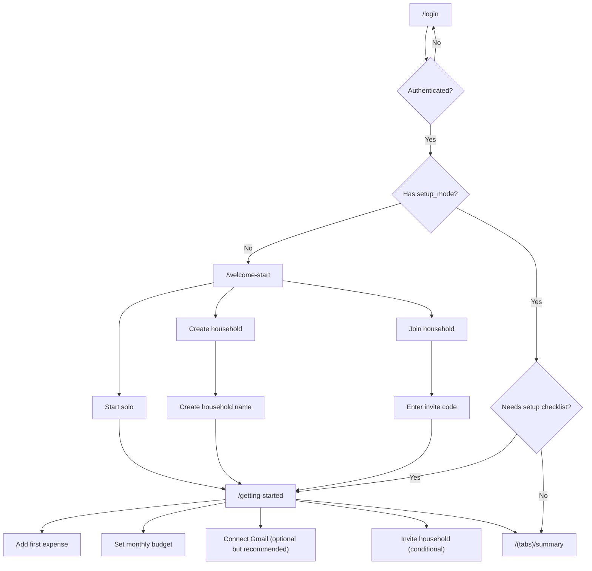

# New User Flow Redesign

## Goal

Turn the current "auth -> maybe onboarding -> summary" path into a clear first-run experience that helps a brand-new user:

1. understand what Adlo is for
2. choose how they are starting
3. complete the minimum setup to get value
4. land in Summary with clear next actions instead of a quiet or confusing dashboard

## Why this needs to change

Right now the product has strong building blocks, but the setup story is fragmented:

- `/login` focuses on authentication, not intent
- `/onboarding` only asks about household setup
- budget, Gmail, and first expense entry live in separate parts of the app
- Summary can feel empty or diagnostic-heavy before the user has any history

That means a new user can successfully enter the app without ever feeling guided into a first "aha."

## Product principles

- Setup should feel like momentum, not paperwork
- Solo use must be a first-class mode, not an implicit skip
- The first-run path should center on value creation:
  - add something
  - define a budget
  - optionally connect Gmail
- Diagnostics should never be the default answer for a new user
- Household setup is important, but it is only one part of getting started

## New state model

We should stop using "has household" as the only proxy for setup progress.

### New user-facing setup states

- `guest_solo`
- `account_solo`
- `household_creator`
- `household_member`

### New setup progress fields

- `setup_mode`
  - `solo`
  - `create_household`
  - `join_household`
- `onboarding_complete`
- `first_expense_logged_at`
- `budget_initialized_at`
- `gmail_connected_at`
- `household_setup_completed_at`

These can live in user metadata, a lightweight app preferences table, or a dedicated setup-progress table.

The important thing is that "I am tracking solo" becomes an explicit durable choice.

## Route / flow overview

## Screen inventory

### 1. Redesign existing `/login`

This remains the auth screen, but it should frame the app more clearly.

#### Jobs

- explain the product in one sentence
- make the auth choice feel calm and trustworthy
- give guest mode a clear role
- support upgrading from anonymous to a real account

#### Required changes

- keep:
  - Google sign-in
  - Apple sign-in when available
  - Continue without account
- change the copy so the user knows what happens next
- if an anonymous session already exists and the user taps Google or Apple, link/upgrade the guest account instead of bouncing them back to Summary

#### Proposed copy

- title: `Adlo`
- subtitle: `Stay on top of spending without building a spreadsheet.`
- guest helper:
  - `Try it first. You can turn this into an account later.`

#### Primary CTA order

1. `Continue with Google`
2. `Continue with Apple`
3. `Try it first`

---

### 2. Replace current `/onboarding` with `/welcome-start`

The current screen only handles household setup. The new version should ask a broader question:

- `How are you starting?`

#### Jobs

- let the user choose solo vs shared intentionally
- keep the path lightweight
- avoid forcing household language onto solo users

#### Options

1. `Track solo`
   - for one-person use
2. `Create a household`
   - for couples/families/roommates starting fresh
3. `Join a household`
   - for invited members

#### Behavior

- `Track solo`
  - sets `setup_mode = solo`
  - sets `onboarding_complete = true`
  - routes to `/getting-started`
- `Create a household`
  - opens a short naming step
  - then routes to `/getting-started`
- `Join a household`
  - opens invite token step
  - then routes to `/getting-started`

#### Important rule

Do not treat `Track solo` as a skip. It is a complete setup choice.

---

### 3. Add new `/getting-started`

This is the missing setup bridge.

#### Jobs

- turn setup into progress
- make the next best action obvious
- let the user do setup in any order while still feeling guided

#### Structure

##### Header

- eyebrow: `Getting started`
- title: `Make Adlo useful in a few minutes`
- body:
  - `The more context you give Adlo, the better the reminders, pacing, and review suggestions get.`

##### Progress block

- `0 of 3 done`
- progress bar or ring

##### Checklist cards

For solo mode:
- `Add your first expense`
- `Set a monthly budget`
- `Connect Gmail` (optional but recommended)

For household creator:
- `Add your first expense`
- `Set a monthly budget`
- `Invite someone`
- `Connect Gmail`

For joined household member:
- `Add your first expense`
- `Review your shared setup`
- `Connect Gmail`

##### Footer actions

- primary CTA changes based on the highest-value incomplete step
- secondary CTA:
  - `Finish later`

#### Step behavior

##### Add your first expense

Opens the floating add launcher or a dedicated first-entry entry point.

Preferred first-entry options:
- type it naturally
- manual add
- scan receipt

##### Set a monthly budget

Deep links into budget setup.

##### Connect Gmail

Deep links into Gmail import with a simpler first-run explanation state.

##### Invite someone

Deep links into account/household invite flow.

#### Completion rule

The checklist should stop being a blocking screen once:

- first expense is logged
- budget is set

Gmail remains recommended, not required.

---

### 4. Redesign Summary for first-run accounts

Summary should adapt when setup progress is still thin.

#### Current problem

When there is no meaningful history yet, Summary can show:

- spend shell
- no insights
- diagnostics CTA
- no recent activity

That is structurally correct, but not a cohesive first-run experience.

#### New first-run Summary module

Before the normal insight rail, show a setup card when:

- there are fewer than 3 confirmed expenses
  OR
- no budget is set
  OR
- setup checklist is still open

#### Card structure

- eyebrow: `Getting started`
- title: `A little setup unlocks the useful stuff`
- short body tailored to what is missing
- checklist rows with status:
  - Add your first expense
  - Set a monthly budget
  - Connect Gmail
- primary CTA:
  - highest-value incomplete task
- secondary CTA:
  - `See setup checklist`

#### Important change

When the user is clearly still in first-run mode, replace the current diagnostics-oriented empty insight card with setup guidance.

Diagnostics should remain available from Settings and for mature users with a genuine insight issue.

---

### 5. Redesign existing Gmail first-run state

The Gmail screen is currently good for an informed user, but heavy for setup mode.

#### First-run connected state should emphasize

- what Gmail helps with
- that the connection is optional
- what happens after connecting

#### First-run disconnected state should show

- title: `Bring in emailed receipts automatically`
- bullets:
  - `Import receipts instead of typing everything`
  - `Catch review items in one place`
  - `Build insight history faster`
- CTA:
  - `Connect Gmail`

Only after connection should the more operational sections take over.

---

### 6. Copy redesigns for Activity and Actions empty states

These do not need brand-new screens, but they do need a clearer first-run role.

#### Activity empty state

Current:
- `No expenses yet. Tap + to get started.`

Proposed:
- title: `No spending history yet`
- body: `Add your first expense and Adlo will start building your timeline here.`
- inline CTA:
  - `Add first expense`

#### Actions empty state

Current:
- `Nothing needs your attention right now. New review work will land here when it needs you.`

Proposed for first-run:
- title: `No actions yet`
- body:
  - if Gmail not connected: `Reviews, import checks, and other follow-ups will land here once Adlo has more to work with.`
  - if Gmail connected: `Receipt reviews and follow-ups will show up here when they need you.`

## Detailed build rules

### Login upgrade behavior

If the current session is anonymous and the user selects Google or Apple:

- do not early-return to Summary
- perform an account-link/upgrade flow
- preserve local drafts and cached progress when possible

### Setup routing rules

- logged-out user -> `/login`
- authenticated user with no `setup_mode` -> `/welcome-start`
- authenticated user with `setup_mode` but incomplete checklist -> `/getting-started`
- authenticated user with minimum setup complete -> Summary

### First-run Summary rules

Show setup card when any are true:

- no confirmed expenses
- budget missing
- checklist incomplete

Hide setup card when:

- first expense exists
- budget exists
- user dismissed checklist after completion threshold

### Household rules

- solo users should never be nagged back into household onboarding
- household creator sees invite setup as part of checklist
- joined member does not need to create household metadata

## Analytics / success metrics

Track:

- login -> authenticated
- authenticated -> `setup_mode` chosen
- `setup_mode` chosen -> first expense logged
- `setup_mode` chosen -> budget set
- `setup_mode` chosen -> Gmail connected
- time to first confirmed expense
- time to first surfaced insight

Success looks like:

- lower drop-off between auth and first expense
- more users setting a budget in session one
- fewer support/confusion reports around solo mode and onboarding loops

## Recommended implementation order

### Phase 1

- fix state model
- fix anonymous upgrade path
- replace onboarding with start-mode chooser

### Phase 2

- add `/getting-started`
- add Summary first-run checklist card

### Phase 3

- simplify Gmail first-run state
- rewrite Activity and Actions empty states

## Mockup set

The visual mockups for this spec live in:

- [`docs/design-mockups/new-user-auth-choice.svg`](../../design-mockups/new-user-auth-choice.svg)
- [`docs/design-mockups/new-user-setup-path.svg`](../../design-mockups/new-user-setup-path.svg)
- [`docs/design-mockups/new-user-setup-checklist.svg`](../../design-mockups/new-user-setup-checklist.svg)
- [`docs/design-mockups/new-user-summary-first-run.svg`](../../design-mockups/new-user-summary-first-run.svg)
- [`docs/design-mockups/new-user-flow-mockups-notes.md`](../../design-mockups/new-user-flow-mockups-notes.md)
